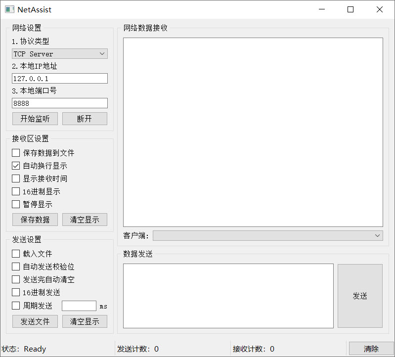

# NetAssist 网络调试助手
跨平台网络调试助手

## 设计背景
在做课题的时候总是使用网上找到的网络上位机，属于自己的上位机却没有完成。本上位机参考了网络上存在的Python上位机的部分代码，界面布局参考的是Windows环境下有个比较好的网络调试助手（NetAssist 野人）。

## 运行环境
- Python3.6.5
- PyQt5.11.3
- 原生Socket
- 原生threading

## 功能说明
- UDP 数据收发
- TCP Client/Server 数据收发
- 字符型/十六进制数据发送和显示
- 指定文件内容发送和接收转向文件
- 数据循环发送
- 状态栏添加状态信息

## 现有问题
- darkstyle的QSS皮肤未添加
- 自动发送校验位未添加

## 下一步改进
- 美化界面
- 完成发送校验位功能

